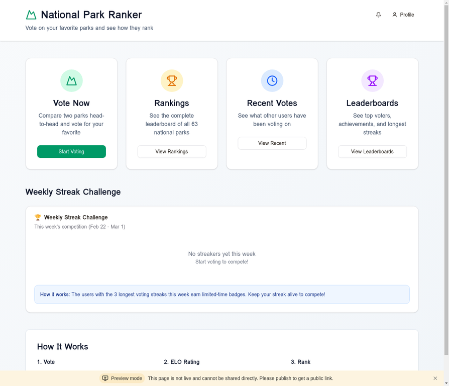

<div align="center">

# 🏔️ National Park Ranker

[](https://react.dev/)
[](https://www.typescriptlang.org/)
[](https://trpc.io/)
[](https://tailwindcss.com/)
[](https://nodejs.org/)
[](https://www.mysql.com/)
[](LICENSE)

**Vote on your favorite national parks and watch them compete in real-time rankings**

[Live Demo](https://3000-i5x6uth87wctn2gdj8h3j-b12462a4.sg1.manus.computer) · [Report Bug](https://github.com/ngys9919/manus-voting-ranking/issues) · [Request Feature](https://github.com/ngys9919/manus-voting-ranking/issues)

</div>

## Screenshot



## 📖 About

National Park Ranker is an interactive web application that lets users vote on their favorite U.S. National Parks through head-to-head matchups. Using the ELO rating system (borrowed from chess), parks compete for rankings based on community votes. The platform features real-time leaderboards, achievement systems, referral programs, and weekly streak challenges to keep users engaged.

### ✨ Key Features

| Feature | Description |
|---------|-------------|
| **Head-to-Head Voting** | Compare two random parks and vote for your favorite |
| **ELO Rating System** | Dynamic rankings that update based on vote outcomes |
| **Real-Time Leaderboards** | Track top voters, longest streaks, and achievements |
| **Weekly Streak Challenges** | Compete for limited-time badges with consecutive daily votes |
| **Achievement System** | Unlock badges for voting milestones (10, 50, 100+ votes) |
| **Referral Program** | Invite friends with personalized codes and email templates |
| **Real-Time Notifications** | Get instant alerts when friends join or achievements unlock |
| **Bulk Notification Management** | Select and delete multiple notifications at once |
| **Recent Votes Feed** | See what the community is voting on |
| **Park Rankings** | Complete leaderboard of all 63 U.S. National Parks |

## 🛠️ Tech Stack

| Category | Technologies |
|----------|-------------|
| **Frontend** | React 19, TypeScript, Tailwind CSS 4, Wouter (routing), shadcn/ui |
| **Backend** | Node.js 22, Express 4, tRPC 11, Drizzle ORM |
| **Database** | MySQL 8.0 (TiDB compatible) |
| **Authentication** | Manus OAuth, JWT sessions |
| **Real-Time** | tRPC subscriptions, polling (30s intervals) |
| **Email** | HTML/Plain-text templates (SendGrid/AWS SES ready) |
| **Testing** | Vitest, React Testing Library |
| **Deployment** | Manus Platform (built-in hosting) |
| **Build Tools** | Vite, pnpm, tsx |

## 🏗️ Architecture

```
┌─────────────────────────────────────────────────────────────┐
│                        Client Layer                          │
│  React 19 + Tailwind 4 + tRPC Client + shadcn/ui           │
│  (Voting UI, Rankings, Leaderboards, Notifications)         │
└────────────────────────┬────────────────────────────────────┘
                         │ tRPC (Type-safe API)
┌────────────────────────▼────────────────────────────────────┐
│                     Application Layer                        │
│  Express + tRPC Server + Manus OAuth + JWT Sessions         │
│  (Procedures: vote, getRankings, getLeaderboards, etc.)     │
└────────────────────────┬────────────────────────────────────┘
                         │ Drizzle ORM
┌────────────────────────▼────────────────────────────────────┐
│                       Data Layer                             │
│  MySQL 8.0 (TiDB) - Parks, Votes, Users, Achievements,     │
│  Referrals, Notifications, Streaks, Challenges              │
└─────────────────────────────────────────────────────────────┘
```

### Data Flow

1. **User votes** → tRPC mutation → ELO calculation → Database update → Real-time leaderboard refresh
2. **Achievement unlock** → Background job checks milestones → Create notification → Client polls → Confetti animation
3. **Referral signup** → Complete referral → Notify referrer → Update stats → Award rewards
4. **Weekly challenge** → Cron job (Sundays 3 PM) → Calculate top 3 streakers → Award badges → Send notifications

## 📁 Project Structure

```
national-park-ranker/
├── client/                    # Frontend React application
│   ├── public/               # Static assets
│   ├── src/
│   │   ├── components/       # React components
│   │   │   ├── NotificationCenter.tsx    # Notification UI with bulk delete
│   │   │   ├── ReferralDashboard.tsx     # Referral stats & invite UI
│   │   │   ├── VotingInterface.tsx       # Head-to-head voting
│   │   │   └── ...
│   │   ├── pages/            # Page-level components
│   │   ├── lib/trpc.ts       # tRPC client setup
│   │   ├── App.tsx           # Routes & layout
│   │   └── main.tsx          # React entry point
├── server/                    # Backend Node.js application
│   ├── routers.ts            # tRPC procedures (API endpoints)
│   ├── db.ts                 # Database query helpers
│   ├── _core/                # Framework-level code (OAuth, LLM, etc.)
│   ├── *.test.ts             # Vitest unit tests
│   └── ...
├── drizzle/                   # Database schema & migrations
│   └── schema.ts             # Table definitions
├── shared/                    # Shared types & constants
├── storage/                   # S3 file storage helpers
├── package.json              # Dependencies & scripts
├── vite.config.ts            # Vite build configuration
└── README.md                 # This file
```

## 🚀 Getting Started

### Prerequisites

- **Node.js** 22.x or higher
- **pnpm** 9.x or higher
- **MySQL** 8.0 or compatible (TiDB, PlanetScale)
- **Manus Platform account** (for OAuth and deployment)

### Installation

1. **Clone the repository**
   ```bash
   git clone https://github.com/ngys9919/manus-voting-ranking.git
   cd manus-voting-ranking
   ```

2. **Install dependencies**
   ```bash
   pnpm install
   ```

3. **Set up environment variables**
   
   The following environment variables are automatically injected by Manus Platform:
   - `DATABASE_URL` - MySQL connection string
   - `JWT_SECRET` - Session signing secret
   - `VITE_APP_ID` - OAuth application ID
   - `OAUTH_SERVER_URL` - OAuth backend URL
   - `VITE_OAUTH_PORTAL_URL` - OAuth login portal URL
   - `OWNER_OPEN_ID`, `OWNER_NAME` - Owner information
   - `BUILT_IN_FORGE_API_URL`, `BUILT_IN_FORGE_API_KEY` - Built-in APIs

   For local development, create a `.env` file with these values (contact Manus support for credentials).

4. **Push database schema**
   ```bash
   pnpm db:push
   ```

5. **Seed the database** (optional)
   ```bash
   pnpm db:seed
   ```

### Running Locally

```bash
pnpm dev
```

The application will start on `http://localhost:3000`

### Running Tests

```bash
# Run all tests
pnpm test

# Run specific test file
pnpm test server/bulkNotificationDeletion.test.ts

# Watch mode
pnpm test --watch
```

## 📦 Deployment

### Manus Platform (Recommended)

The project is designed for deployment on Manus Platform with built-in hosting:

1. Create a checkpoint via the Management UI
2. Click "Publish" in the header
3. Configure custom domain in Settings → Domains (optional)

### Docker (Alternative)

```dockerfile
FROM node:22-alpine
WORKDIR /app
COPY package.json pnpm-lock.yaml ./
RUN npm install -g pnpm && pnpm install --frozen-lockfile
COPY . .
RUN pnpm build
EXPOSE 3000
CMD ["pnpm", "start"]
```

Build and run:
```bash
docker build -t national-park-ranker .
docker run -p 3000:3000 --env-file .env national-park-ranker
```

## 🤝 Contributing

Contributions are welcome! Please follow these steps:

1. **Fork** the repository
2. **Create** a feature branch (`git checkout -b feature/AmazingFeature`)
3. **Commit** your changes (`git commit -m 'Add some AmazingFeature'`)
4. **Push** to the branch (`git push origin feature/AmazingFeature`)
5. **Open** a Pull Request

Please ensure:
- All tests pass (`pnpm test`)
- Code follows the existing style (TypeScript, React best practices)
- New features include tests

## 📝 License

This project is licensed under the MIT License - see the [LICENSE](LICENSE) file for details.

## 🏢 Developed By

**Tertiary Infotech Academy Pte. Ltd.**

A project built with [Manus AI](https://manus.im) - The AI-powered development platform.

## 🙏 Acknowledgements

- **National Park Service** for park data and inspiration
- **shadcn/ui** for beautiful React components
- **tRPC** for type-safe API development
- **Tailwind CSS** for utility-first styling
- **Manus Platform** for hosting and OAuth infrastructure

---

<div align="center">

**⭐ Star this repo if you find it helpful!**

[Report Bug](https://github.com/ngys9919/manus-voting-ranking/issues) · [Request Feature](https://github.com/ngys9919/manus-voting-ranking/issues) · [Discussions](https://github.com/ngys9919/manus-voting-ranking/discussions)

</div>
